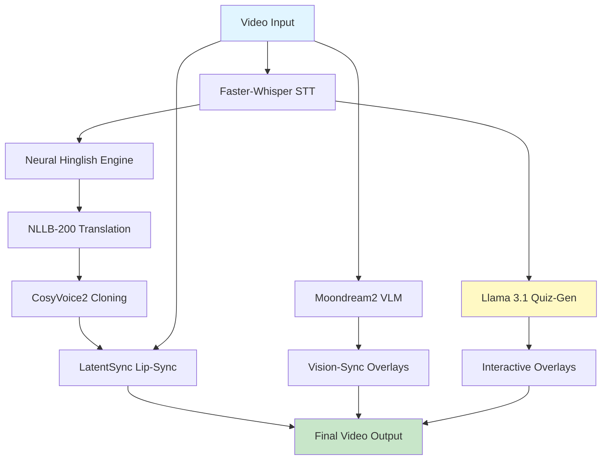

# Sanskriti-Flow

> **The Autonomous, Vision-Aware Localization & Assessment Ecosystem**

[](https://www.gnu.org/licenses/gpl-3.0)
[](https://fossunited.org)
[](https://www.python.org/downloads/)

Making world-class education accessible in every Indian language.

---

## 🎯 The Problem

Despite the digital revolution, a **"Knowledge Lockdown"** exists where **70% of world-class technical education** (NPTEL, MIT OCW, Coursera) is restricted to English. Current AI dubbing solutions suffer from:

- **Contextual Blindness:** Translators don't "see" what a professor points at
- **Cognitive Fatigue:** Poor lip-sync creates the "Uncanny Valley" effect
- **Technical Hallucinations:** "Python" becomes "Snake," "Cloud" becomes "Weather"
- **Passive Learning Gap:** No active engagement or comprehension checks

## 💡 The Solution

Sanskriti-Flow is a **100% Free and Open Source (FOSS)** infrastructure that transforms English educational videos into interactive native-language experiences.

### How it Works

1. **Smart Translation:** Keeps technical terms in English while explaining logic in native language
2. **Voice Cloning:** Professor speaks in their own voice, but in a new language
3. **Visual Overlays:** Translated labels appear where the teacher points
4. **Active Assessment:** Pop-up quizzes test knowledge in real-time

---

## 🚀 Features

### Core Foundation
- **Neural Hinglish Engine:** NER-based technical term preservation
- **Zero-Shot Voice Cloning:** CosyVoice2 integration for voice replication

### Killer Features
- **Vision-Sync Overlays:** VLM-powered floating translated labels
- **Neural Mirroring:** LatentSync-based lip-sync for perfect mouth movements
- **Swar (Assistive Audio):** Descriptions for visually impaired students

### Gangster Features
- **Interactive Quiz Overlays:** Llama 3.1-powered MCQ generation with jump-back
- **Drishti (Rural Mode):** 90% bandwidth reduction for 2G/3G networks

---

## 🏗️ Architecture



## 🛠️ Tech Stack (100% FOSS)

| Component | Technology | Purpose |
|-----------|-----------|---------|
| Backend | Python / FastAPI | Async API orchestration |
| Worker Queue | Celery + Redis | GPU-intensive task management |
| Transcription | Faster-Whisper | Local speech-to-text |
| Translation | NLLB-200 | 200+ languages support |
| Video Vision | Moondream2 / YOLOv11 | Frame analysis |
| Lip-Sync | LatentSync | Diffusion-based facial rendering |
| Quiz Logic | LangChain + Llama 3.1 | Generative assessment |
| Frontend | Next.js 15 + Tailwind | Netflix-style UI |

---

## 📦 Installation

### Prerequisites
- Python 3.10+
- Node.js 18+
- Redis
- FFmpeg
- CUDA-capable GPU (recommended)

### Backend Setup
```bash
cd backend
python -m venv venv
source venv/bin/activate  # On Windows: venv\Scripts\activate
pip install -r requirements.txt
uvicorn main:app --reload
```

### Frontend Setup
```bash
cd frontend
npm install
npm run dev
```

### Worker Queue
```bash
celery -A backend.worker worker --loglevel=info
```

---

## 🎯 Usage

### API Example
```python
import requests

response = requests.post("http://localhost:8000/api/v1/localize", json={
    "video_url": "https://example.com/lecture.mp4",
    "target_language": "hi",  # Hindi
    "enable_quiz": True,
    "enable_vision_sync": True
})

job_id = response.json()["job_id"]
```

### Dashboard
Navigate to `http://localhost:3000` for the interactive dashboard.

---

## 🌍 Impact

- **Cost:** $0.05/minute vs $50/minute for human dubbing
- **Speed:** 1-hour lecture ready in 15 minutes
- **Accessibility:** NEP 2020 compliant multilingualism
- **Rural Reach:** Optimized for 2G/3G via Drishti mode

---

## 🗺️ Roadmap

- [x] Core transcription & translation pipeline
- [x] Voice cloning integration
- [ ] Vision-sync overlay system
- [ ] Lip-sync implementation
- [ ] Interactive quiz generation
- [ ] Frontend dashboard
- [ ] Mobile app (Phase 2)
- [ ] Live streaming support (Phase 3)

---

## 🤝 Contributing

We welcome contributions! This project is part of **FOSS Hack 2026** at IIT Bombay.

1. Fork the repository
2. Create your feature branch (`git checkout -b feature/AmazingFeature`)
3. Commit your changes (`git commit -m 'Add AmazingFeature'`)
4. Push to the branch (`git push origin feature/AmazingFeature`)
5. Open a Pull Request

---

## 📄 License

This project is licensed under the **GNU General Public License v3.0** - see the [LICENSE](LICENSE) file for details.

---

## 🏆 FOSS Hack 2026

**Event:** FOSS Hack 2026 (March 1-31, 2026)  
**Organizers:** FOSS United & IIT Bombay FOSSEE  
**Category:** Digital Public Infrastructure

---

## 📧 Contact

For queries, reach out through GitHub Issues or join our community channel.

---

**Built with ❤️ for every student who dreams in their mother tongue.**
